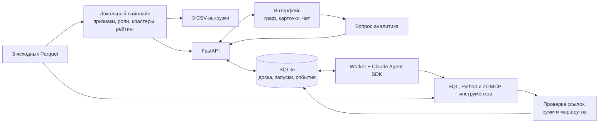

# Falcon — граф денег

Falcon помогает AML-аналитику восстановить структуру сети переводов и решить, **кого проверить первым и почему**. Из трёх файлов с операциями приложение строит граф, определяет наблюдаемые роли участников, выделяет кластеры и составляет список приоритетов. Каждую позицию можно разобрать до связей, сумм и исходных транзакций.

Проект выполнен по заданию [«Граф денег»](task.md). В предоставленной выгрузке известны 81 исходный клиент — **seed**, от которых прослежены исходящие переводы на четыре колена. Всего в сети 2 248 узлов. Аналитику нужно понять, где сходятся потоки от этих клиентов, через кого они проходят и какие участники связывают части сети.

**Начать чтение:** [сценарий аналитика](#workflow) · [устройство](#architecture) · [правила анализа](#method) · [запуск](#launch) · [проверка решения](#verify)

## Что получается на выходе

Аналитик получает схему сети с направлением переводов, поиском по `gid`, раскраской по ролям и кластерам. Рядом с графом доступны приоритетные узлы, карточки участников и оценка устойчивости сети. Результаты можно скачать и передать на дальнейшую проверку.

| Результат | Что в нём | Для чего использовать |
|---|---|---|
| `nodes_roles.csv` | Каждый узел, его роль, `role_score`, кластер, `priority_score` и объяснение `evidence` | Разобрать любого участника сети |
| `clusters.csv` | Размер группы, число seed, внутренний оборот, ключевые `gid` и гипотеза о назначении кластера | Понять структуру сети по группам |
| `top_nodes.csv` | Место в рейтинге, `gid`, роль, приоритет и объяснение `why` | Составить очередь углублённой проверки; по умолчанию 30 узлов |

Обязательные колонки из задания сохранены. Дополнительные признаки в CSV позволяют проверить, из чего складывается вывод. Правила и пороги описаны в разделе [«Как появляются роли и приоритеты»](#method), формулы — в [коде пайплайна](backend/app/pipeline.py).

<a id="workflow"></a>

## Как работает аналитик

### 1. Загружает сеть

В разделе **«Датасеты»** нажмите **«Загрузить»** и выберите одновременно `nodes.parquet`, `edges.parquet` и `transactions.parquet` из папки `data/`. При импорте приложение сразу рассчитывает роли, кластеры и рейтинг. Доступ к AI для этого шага не нужен.

Три файла описывают разные стороны одной сети: `nodes` содержит участников и глубину обхода, `edges` — агрегированные связи, `transactions` — отдельные переводы. [Описание полей](dataset.md) помогает сопоставить исходную выгрузку с результатом.

### 2. Находит приоритетного участника

Откройте **«Сеть»**, выберите узел из топ-листа или найдите его по `gid` — полному или его части (например, последним цифрам). Посмотрите роль, входящие и исходящие связи, связь с seed и объяснение приоритета. Переключение раскраски **«Роли / Кластеры»** показывает тот же граф с другой стороны.

Например, в контрольном расчёте узел `100000003115284100` занимает первое место с приоритетом `0.8853` и ролью `consolidator`. К нему ведут пути от девяти разных seed, два из них переводят напрямую. Видны восемь плательщиков и два получателя. Это конкретные основания начать проверку с данного узла; сами по себе они не устанавливают виновность.

<details>
<summary>Как прочитать такую карточку</summary>

`gid` — обезличенный идентификатор. `role` описывает наблюдаемое поведение в графе. `role_score` показывает силу признаков роли, а `priority_score` — относительный приоритет проверки в этой сети. Эти баллы не являются вероятностью совершения преступления или статистически откалиброванной уверенностью.

`seeds_upstream` считает разные seed, из которых есть направленный путь длиной до трёх переводов к узлу. `seeds_direct` учитывает только прямые переводы. Путь в графе показывает связь участников; доказать, что по всей цепочке прошли одни и те же деньги, по нему нельзя.

</details>

### 3. Проверяет гипотезу

AI-ассистент помогает углубить разбор. На главном экране есть четыре отправные точки:

| Подсказка | Результат разбора |
|---|---|
| «Кого проверять первым?» | Полное расследование: проверка топ-20 рейтинга и кластеров на транзакциях, итог — список 10–20 узлов с обоснованием по каждому |
| «Почему `gid` на 1-м месте?» | Разбор узла №1 рейтинга: метрики и транзакции за ролью, обычное объяснение, чего не хватает |
| «Кто собирает деньги с этих seed?» | Переводы трёх seed с наибольшим приоритетом на 1–3 шага и узлы, где деньги сходятся или остаются |
| «Каких данных не хватает?» | Белые пятна (граница обхода, невидимые входящие, порог 5 000 ₸) и какой запрос сделать следующим |

`gid` в подсказках подставляются из рейтинга текущего набора, а не записаны в коде.

В чате можно уточнить вопрос, попросить проверить обычное объяснение или продолжить исследование. Пока агент работает, одна строка показывает текущий шаг («Анализирую структуру сети…», «Сверяю выводы с транзакциями…»), а раскрыв её, можно увидеть все вызовы инструментов. Версии и доказательства сохраняются в соответствующих разделах. Запуск можно остановить, а затем продолжить новым сообщением: агент продолжает ту же сессию и помнит разговор.

### 4. Забирает результат

В разделе **«Датасеты»** доступны ссылки **«Роли»**, **«Кластеры»**, **«Топ узлов»** для скачивания CSV. Расчётные выгрузки и AI-доска хранятся отдельно: версии агента дополняют исследование, а таблицы ролей и приоритетов формирует воспроизводимый пайплайн.

При открытии CSV в Excel импортируйте `gid` как текст: длинные идентификаторы иначе могут потерять точность.

<a id="architecture"></a>

## Что происходит внутри



Пайплайн обрабатывает весь граф по фиксированным правилам. Он запускается одной командой, не вызывает модель и создаёт обязательные результаты даже без запущенного веб-приложения.

FastAPI связывает интерфейс с данными. При загрузке он сохраняет набор, запускает расчёт и предоставляет граф, карточки и CSV. SQLite хранит расследования, очередь запусков и события. За счёт этого результаты остаются после перезапуска сервера.

Worker выполняет AI-запросы отдельным процессом. Claude изучает данные через SQL и Python, а через MCP-инструменты записывает кандидатов, версии, доказательства, связи и возражения. MCP здесь — способ дать модели доступ к конкретным функциям приложения. Прогресс поступает в браузер через SSE, то есть поток серверных событий.

| Технология | Зачем она в проекте |
|---|---|
| Python, pandas, PyArrow | Чтение Parquet, подготовка признаков и формирование CSV |
| DuckDB | SQL-запросы и агрегаты над транзакциями |
| NetworkX | Графовые метрики, компоненты, кластеризация Louvain и устойчивость |
| FastAPI, SQLite | HTTP API, постоянное состояние и очередь задач |
| Next.js, React, TypeScript | Веб-интерфейс и взаимодействие с аналитиком |
| Sigma.js, Graphology | Отображение сети и работа с графом в браузере |
| Claude Agent SDK (Python) | Работа агента, MCP-инструменты и продолжение сессий |
| SciPy | PageRank на разреженных матрицах |

<details>
<summary>Где искать реализацию</summary>

| Путь | Содержание |
|---|---|
| [`backend/app/pipeline.py`](backend/app/pipeline.py) | Правила ролей, признаки, кластеризация, рейтинг, устойчивость и CSV |
| [`backend/app/api/main.py`](backend/app/api/main.py) | Импорт, API, SSE и управление запусками |
| [`backend/app/agent/`](backend/app/agent/) | Инструкции, Claude runner и инструменты расследования |
| [`backend/app/verification.py`](backend/app/verification.py) | Проверки доказательств, связей и маршрутов |
| [`backend/app/worker.py`](backend/app/worker.py) | Обработка очереди AI-запросов |
| [`backend/app/titles.py`](backend/app/titles.py) | Короткие названия чатов (Claude Haiku) |
| [`frontend/components/network/`](frontend/components/network/) | Схема сети и карточки узлов |
| [`frontend/components/InvestigatorApp.tsx`](frontend/components/InvestigatorApp.tsx) | Главный экран и подсказки чата |
| [`backend/tests/`](backend/tests/) | Автоматические проверки |

Рабочие части приложения — `backend/` и `frontend/`. UI-кит для чата лежит в `frontend/vendor/` (MIT, лицензии сохранены). Исходные файлы лежат в `data/`; импортированные наборы, SQLite и рабочие файлы агента — в `backend/data/`. `data/`, локальные данные и `.env` исключены из Git.

</details>

<a id="method"></a>

## Как появляются роли и приоритеты

Для каждого узла считаются отправители и получатели, суммы и число переводов, связь с seed, временные совпадения и положение в графе. Из этих признаков формируется роль. Узлы сравниваются также с другими узлами своего колена: различия глубины обхода влияют на доступные наблюдения.

| Роль | Основные условия |
|---|---|
| `consolidator` — консолидация | Не менее 5 плательщиков, которых хотя бы вдвое больше, чем получателей; либо сходимость путей от ≥3 seed при ≥2 плательщиках и числе плательщиков не меньше числа получателей |
| `distributor` — распределение | Не менее 5 получателей и их число ≥2 × max(число плательщиков, 1); исходящие наблюдались |
| `transit` — транзит | Есть входящие и исходящие; ≥50% исходящей суммы переведено в пределах 0–2 дней после поступлений, таких исходящих переводов ≥2; узел не получил одну из предыдущих ролей |
| `coordinator` — связывающий узел | Связи с ≥3 узлами консолидации, распределения или транзита, включая входящую и исходящую связь; либо посредническая центральность в верхних 2% и связи с ≥2 другими кластерами |
| `terminal` — конечный получатель | Есть входящие, нет исходящих, исходящая сторона наблюдалась и не сработало более раннее правило |
| `peripheral` — периферия | Другие правила не сработали; это не подтверждение отсутствия риска |

Порядок правил влияет на результат: сначала консолидация/распределение, затем транзит, координация, конечный получатель. При совпадении первых двух правил выбирается больший балл роли. Граница обхода не получает роли `transit`, `distributor` или `terminal`.

Кластеры выделяются методом Louvain на неориентированном представлении графа. Вес связи — `log(1 + сумма переводов)`: так влияние единичного очень крупного перевода сглаживается. Для повторяемости используется фиксированный seed алгоритма `7`. Направления переводов сохраняются в исходном графе и интерфейсе.

Приоритет соединяет силу роли (25%), связь с seed (25%), временные признаки (20%), центральность (15%), оборот (10%) и оценку кластера (5%). Приоритет уже известных seed умножается на `0.6`, чтобы внимание смещалось выше по цепочкам. Формулы `role_score`, нормализация и все пороги заданы именованными константами в начале [кода пайплайна](backend/app/pipeline.py).

### Что данные позволяют утверждать

На четвёртом колене обход заканчивается: у 444 узлов исходящие не исследованы. Поэтому отсутствие исходящих у такого узла означает неизвестность. На меньшей глубине оно может быть основанием для роли конечного получателя в пределах выгрузки.

Входящие извне выборки не видны, особенно у seed. Суммы в карточке относятся только к наблюдаемой сети; полный баланс и остаток на счёте по ним не восстанавливаются. Переводы меньше 5 000 ₸ отсутствуют, поэтому дробление ниже этого порога исследовать нельзя.

Транзакции содержат дату без времени. Быстрый транзит определяется по дням, а порядок переводов внутри одного дня неизвестен. В датасете нет подтверждённых ролей участников: качество решения проверяется объяснимостью, согласованностью правил и корректностью расчёта. Метрика accuracy по этому набору не заявляется.

Идентификаторы обезличены; ФИО, доходы и другие отсутствующие атрибуты не достраиваются. Предоставленный датасет предназначен для использования в рамках хакатона.

<details>
<summary>Как проверяются выводы AI</summary>

Агент получает численные факты через `node_card` и SQL. При публикации доказательства приложение проверяет существование транзакций, период, заявленные количества и суммы, а также источник расчёта: сохранённый SQL-запрос или скрипт. Для маршрута проверяются связи, порядок по времени и неоднозначность происхождения денег.

Приложение также не даёт:
- назвать узел конечным получателем, если в данных он переводит деньги дальше или находится на границе обхода;
- завершить расследование, не отчитавшись о каждом узле топ-20 рейтинга (разобран или явно назван непроверенным);
- сохранить итог, ответ или доказательство с сокращёнными `gid` или внутренними названиями ролей вместо словаря задания.

Эти проверки относятся к фактам и формату. Свободный текст ответа всё равно требует проверки аналитиком. Гипотеза о назначении группы не становится установленным фактом после успешной проверки суммы.

</details>

<a id="launch"></a>

## Запуск на своей машине

Нужны Python **3.12+** и `uv`. Для интерфейса также нужны Node.js **20.9+** и Bun; в проекте указан Bun **1.2.21**. Первичная установка зависимостей требует интернета. GPU и внешний сервер базы данных не нужны.

### Получить обязательные результаты одной командой

Поместите три исходных Parquet в корневую папку `data/`. Из корня проекта выполните:

```bash
uv run --frozen --directory backend python -m app.pipeline --data ../data --out ../output
```

`uv` установит закреплённые зависимости при необходимости. Команда создаст `output/nodes_roles.csv`, `output/clusters.csv` и `output/top_nodes.csv`. Если файлы уже существуют, этот запуск их перезапишет. Исходные Parquet не меняются. Вход в Claude, подписка и внешняя LLM для расчёта не требуются.

В контрольном запуске 23 сентября 2026 года расчёт занял **1,4 секунды** на текущей машине: 2 248 строк ролей, 67 кластеров и 30 приоритетных узлов. Это замер уже установленного окружения; скорость установки зависимостей в него не входит. Требование задания — расчёт до пяти минут.

### Открыть интерфейс

Подготовьте зависимости из корня проекта:

```bash
(cd backend && uv sync --frozen)
(cd frontend && bun install --frozen-lockfile)
```

Создайте `backend/.env` по образцу [`.env.example`](backend/.env.example), если своего файла ещё нет. Для переносимого локального запуска оставьте `DATA_DIR=./data`: при старте из `backend` это папка состояния приложения. В `frontend/.env.local` задайте:

```dotenv
NEXT_PUBLIC_API_URL=http://localhost:8000
```

Откройте два терминала в корне проекта и оставьте процессы работающими:

| Терминал | Команда | Назначение |
|---|---|---|
| 1 | `cd backend && uv run --frozen uvicorn app.api.main:app --host 127.0.0.1 --port 8000` | API и хранение данных |
| 2 | `cd frontend && bun run dev` | Интерфейс на порту 3000 |

Откройте [localhost:3000](http://localhost:3000) и загрузите все три файла через **«Датасеты»**. Запуск CLI-пайплайна сам по себе не добавляет набор в веб-приложение. Вместо загрузки через браузер можно зарегистрировать папку на сервере: `curl -X POST localhost:8000/datasets/from-path -H 'content-type: application/json' -d '{"path": "../data"}'`. Граф, роли, кластеры и скачивание CSV доступны без AI-worker. Остановить процесс в терминале можно сочетанием `Ctrl+C`.

### Подключить AI-ассистента

Claude Agent SDK запускает Claude Code CLI. Нужен вход одним из способов:
- выполненный вход в [Claude Code](https://docs.claude.com/en/docs/claude-code) (`claude`, затем `/login`) — запросы идут по вашей подписке;
- или `ANTHROPIC_API_KEY` в `backend/.env` — оплата по API за токены.

`CLAUDE_CLI_PATH` в `.env` можно оставить пустым: тогда используется копия CLI, которая идёт вместе с SDK. Личные настройки и MCP-серверы вашего Claude Code агенту не передаются.

В третьем терминале из корня запустите:

```bash
cd backend && uv run --frozen python -m app.worker
```

Основное исследование использует `claude-sonnet-5` (`AGENT_MODEL`), короткие названия чатов — `claude-haiku-4-5`. Модель, усилие рассуждения (`AGENT_EFFORT`), лимит ходов и бюджета меняются в `.env`. Исследование с AI требует сети и может занимать дольше локального расчёта CSV: полное расследование — около 10 минут, вопрос по узлу — меньше минуты.

Parquet, база и рабочие файлы хранятся локально. При включённом AI запросы и содержимое, которое агент получает через инструменты, передаются модели Anthropic. Это следует учитывать при выборе данных для исследования.

Проверить готовность можно через [health](http://localhost:8000/health): `ok: true` означает, что API отвечает, а `worker_alive: true` — что worker передаёт сигнал активности. Это не проверка доступности модели: её показывает первый запрос в чате. Документация HTTP API доступна в [Swagger UI](http://localhost:8000/docs).

<details>
<summary>Если что-то не запускается</summary>

| Симптом | Что проверить |
|---|---|
| «Агент не запущен» | Работает ли третий терминал и есть ли `worker_alive: true` в health |
| Интерфейс не получает данные | Адрес API в `frontend/.env.local` и доступность порта 8000; после смены `.env.local` перезапустите Next.js |
| Граф пуст после CLI-расчёта | Импортируйте три Parquet в интерфейсе: CLI создаёт CSV отдельно |
| Ошибка авторизации или модели | Вход в Claude Code или `ANTHROPIC_API_KEY`, доступ аккаунта к `AGENT_MODEL`; `CLAUDE_CLI_PATH` оставьте пустым, чтобы использовался CLI из SDK |
| Порт занят | Проверьте, не запущена ли уже эта копия. При смене порта API обновите `NEXT_PUBLIC_API_URL` |
| Запуск остановился по лимиту | Результаты доски сохранены; уточните запрос или продолжите новым сообщением. `AGENT_MAX_BUDGET_USD` ограничивает оценочную стоимость запуска по данным CLI, а не реальный счёт |

</details>

<a id="verify"></a>

## Как воспроизвести и проверить решение

Проверка начинается с команды пайплайна выше. Сравните размеры файлов с контрольным запуском, откройте произвольный `gid` в CSV и в интерфейсе, затем сопоставьте признаки с правилом роли. Повторный запуск с теми же исходными данными, зависимостями и параметрами должен дать те же расчётные результаты. Ответы AI могут различаться.

Автоматические проверки запускаются из корня:

```bash
(cd backend && uv run --frozen pytest -q)
```

Тесты проверяют правила ролей, границу обхода, сравнение с узлами своего колена, формат CSV и лимит `evidence`, импорт графа, устойчивость, проверки доказательств и связей, API, карточку узла, запрет ложного «конечного получателя», контроль топ-20, проверку итоговых текстов и названия чатов. Они не обращаются к внешней модели. Проверка на полном датасете запускается при наличии файлов в `data/`; без них соответствующий тест пропускается.

<details>
<summary>Дополнительные проверки интерфейса и настоящего Claude</summary>

Из `frontend` можно выполнить `bun run lint`, `bunx tsc --noEmit` и `bun run build`. Они проверяют код и сборку; сценарий в браузере — вручную по маршруту демонстрации ниже.

Живую проверку агента проще всего сделать подсказкой «Почему `gid` на 1-м месте?» в новом чате: короткий ответ занимает меньше минуты, расходует лимит аккаунта и не меняет существующие расследования.

</details>

### Маршрут демонстрации на пять минут

| Время | Что показать | Что этим проверяется |
|---|---|---|
| 0:00–1:00 | Запустить расчёт и открыть три CSV | Воспроизводимость и обязательные выходы |
| 1:00–2:00 | Загрузить набор, открыть сеть и верх рейтинга | Роли, приоритеты и визуализация |
| 2:00–3:00 | Найти выбранный жюри `gid`, объяснить роль по признакам | Поиск, связи и объяснимость |
| 3:00–4:00 | Сопоставить конечный узел глубины 2 (например, `100000006755850100`: получил 443 476 ₸, не отправил ничего) с узлом глубины 4; открыть кластеры | Учёт границы данных и структура сети |
| 4:00–5:00 | Показать AI-разбор и его доказательства либо вкладку «Устойчивость» | Дополнительные возможности |

Время ответа модели не гарантируется. Для демонстрации можно заранее подготовить AI-разбор и явно обозначить его как сохранённый, а локальный расчёт выполнить вживую.

## Что изменится на миллионе узлов

Текущий граф помещается в память обычного ноутбука. На миллионе узлов основными затратами станут хранение графа в NetworkX, центральности и соединения транзакций для поиска маршрутов. Потребуются колоночное хранение промежуточных признаков, обработка по компонентам и датам, более экономичная графовая библиотека и приближённые центральности. Временные цепочки разумно искать сначала среди кандидатов с высоким приоритетом.

В коде уже есть переход к выборочной betweenness после 20 тысяч узлов, но это не подтверждает готовность всей системы к миллиону. Для такого масштаба также нужны загрузка графа в интерфейс по частям, пересмотр нормализации приоритетов и замеры памяти и времени.
