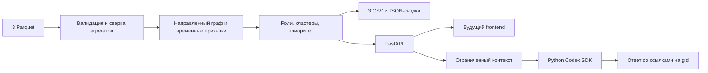

# Граф денег — backend

Python 3.12+, FastAPI, pandas/PyArrow, NetworkX и официальный Python Codex SDK (`openai-codex`).
Фронтенд пока не реализован; `frontend/` зарезервирован. Исходные Parquet остаются в корневой `data/`.

## Быстрый старт

Нужны Python 3.12+ и [uv](https://docs.astral.sh/uv/getting-started/installation/).
Из корня проекта одна команда устанавливает зафиксированные зависимости и создаёт выгрузки:

```bash
uv run --project backend --locked money-graph analyze
```

Результат в `backend/output/`:

- `nodes_roles.csv` — роль, скор, кластер, приоритет и объяснение для каждого узла;
- `clusters.csv` — размер, seed, внутренний оборот, топ-5 gid и гипотеза;
- `top_nodes.csv` — топ-50, ранги и объяснение каждого приоритета;
- `summary.json` — сводка и ограничения наблюдений.

Можно задать другую папку с тремя файлами той же схемы:

```bash
uv run --project backend --locked money-graph analyze --data-dir ./data --output-dir ./backend/output --top 100
```

`--top >= 20`; для графа меньше 20 узлов выводятся все. CSV используют UTF-8 и сохраняют gid как int64-совместимые десятичные числа. При открытии в Excel импортируйте gid **как текст**: Excel может округлить длинные идентификаторы.

## HTTP API

```bash
uv run --project backend --locked money-graph serve
```

Сервер: [127.0.0.1:8000](http://127.0.0.1:8000). Интерактивная документация: [/docs](http://127.0.0.1:8000/docs); схема: [/openapi.json](http://127.0.0.1:8000/openapi.json).
Это документация API, интерфейс исследования графа пока не создан.

При запуске сервер валидирует данные и рассчитывает снимок в памяти. CSV доступны прямо из этого снимка без предварительного CLI-запуска. Перезапуск воспроизводит расчёт. Для локального хакатона не нужны БД, Redis или Docker.

| Метод и путь | Назначение |
|---|---|
| `GET /health` | Готовность и включён ли AI |
| `GET /api/v1/summary` | Размер сети, оборот, распределение ролей, ограничения |
| `GET /api/v1/nodes` | Фильтры `gid`, `role`, `cluster_id`, `is_seed`, `min_priority`; `offset`, `limit` |
| `GET /api/v1/nodes/{gid}` | Метрики, роль, объяснение, вклады в приоритет, ограничения |
| `GET /api/v1/nodes/{gid}/neighbors` | Связи; `direction=in/out/both`, пагинация |
| `GET /api/v1/nodes/{gid}/transactions` | Транзакции с датами, пагинация |
| `GET /api/v1/top?limit=50` | Ранжированный список |
| `GET /api/v1/clusters` | Список кластеров, пагинация |
| `GET /api/v1/clusters/{cluster_id}` | Карточка кластера |
| `GET /api/v1/graph` | Направленные рёбра и узлы для визуализации |
| `GET /api/v1/paths?src=...&dst=...&max_hops=4` | Кратчайший направленный путь |
| `GET /api/v1/exports/{filename}` | Одна из трёх CSV-выгрузок |
| `POST /api/v1/analysis/rebuild` | Перечитать настроенную папку данных |
| `POST /api/v1/assistant/query` | Вопрос к Codex по результатам анализа |

В **JSON все идентификаторы узлов — строки**, включая `gid`, `src`, `dst`, `top_gids`, `path` и `cited_gids`. Не преобразовывайте их в JavaScript `Number`. В URL используйте исходную строку.

`/graph?limit=5000` возвращает весь предоставленный граф. По умолчанию лимит 1000 узлов, есть `truncated` и `total_nodes`. Параметры `gid=...&hops=2` выбирают окрестность по обоим направлениям, `cluster_id` ограничивает кластером. Рёбра сохраняют направление и всегда соединяют включённые узлы. Структурный путь не доказывает прохождение одних и тех же средств по цепочке.

`rebuild` выполняет валидацию до замены снимка. При ошибке возвращает 422 и сохраняет предыдущий результат. Параллельный пересчёт возвращает 409. CLI записывает каждый файл атомарно; четыре файла не являются общей файловой транзакцией. Используйте один процесс API: несколько воркеров имеют независимые снимки.

## Codex SDK

Используется именно [официальный Python Codex SDK](https://learn.chatgpt.com/docs/codex-sdk), а не подмена вызовом Chat Completions. SDK запускает закреплённый Codex runtime, создаёт временную задачу и возвращает структурированный ответ. Модель можно задать переменной окружения; без неё используется настройка Codex.

Авторизуйтесь через установленный Codex CLI:

```bash
codex login
MONEY_GRAPH_AI_ENABLED=1 uv run --project backend --locked money-graph serve
```

Пример запроса:

```bash
curl -X POST http://127.0.0.1:8000/api/v1/assistant/query \
  -H 'Content-Type: application/json' \
  -d '{"question":"Кого проверить первым и почему?","gids":[],"hops":2}'
```

Для вопроса «кто собирает деньги с этих пятерых?» передайте пять точных gid в массиве `gids` (строки). Backend сам найдёт кандидатов на исходящих путях, ранжируя сначала по числу достигших их выбранных узлов, затем по приоритету. В контекст попадают выбранные узлы и кандидаты — максимум 80 узлов и 200 внутренних рёбер. Без `gids` используется топ-30. Контекст содержит границы охвата и метрики; это не произвольный SQL/код, генерируемый моделью.

Ответ: `answer`, `cited_gids`, `limitations`, `suggested_checks`. Ссылки проверяются по переданному контексту. Ответ модели не меняет роли, скоры, файлы или исходные данные. Корректность всех текстовых утверждений модели автоматически не доказана — сверяйте их с карточками узлов.

AI по умолчанию отключён и возвращает 503 с объяснением. Основной пайплайн работает без интернета, авторизации и платного сервиса. При включённом AI выбранный аналитический контекст отправляется сервису Codex. Ограничения: 4000 символов вопроса, 20 выбранных gid, одна активная генерация, общий таймаут 90 секунд вместе с ожиданием. Нет общей истории разговоров. Ошибки провайдера не выдаются клиенту дословно.

SDK использует временную рабочую папку, `read-only`, запрет разрешений и отключённый shell/web search. Приложения, плагины, браузерные инструменты и MCP-серверы из пользовательского config.toml и его профилей отключаются для запуска ассистента без изменения конфигурации на диске. Это локальный прототип, а не изоляция уровня отдельного контейнера. Для банковского развёртывания нужны отдельный служебный профиль Codex, сетевые политики и согласованный режим обработки данных.

Переменные описаны в `.env.example`. Файл `.env` сам по себе не загружается; используйте `uv run --env-file backend/.env --project backend --locked money-graph serve` или экспорт переменных в shell.

## Проверки

```bash
uv run --project backend --locked pytest backend/tests -q
uv run --project backend --locked ruff check backend
uv run --project backend --locked ruff format --check backend
```

Тесты не вызывают внешний LLM. Проверяются правила ролей, цензурирование depth=4, детерминизм, сохранение изолятов, сверка исходных таблиц, контракты HTTP, JSON int64, ограничение AI-контекста и обработка ошибок. Реальный SDK дополнительно проверен синтетическим запросом без транзакционных данных.

На предоставленном наборе: 2248 узлов, 3119 рёбер, 4840 транзакций, 81 seed, 444 узла четвёртого колена. Полный расчёт и выгрузка локально занимают менее секунды (время установки зависимостей отдельно). 16 компонент со связями и 19 изолятов дают **35** слабосвязных компонент. Сумма по файлам — **365 890 012,01 KZT**.

## Архитектура



`data.py` — валидация; `analysis.py` — аналитика; `export.py` — выгрузки; `api.py` и `schemas.py` — HTTP-контракт; `assistant.py` — Codex; `cli.py` — команды. Формулы и пороги: [METHODOLOGY.md](METHODOLOGY.md).

API слушает только `127.0.0.1` по умолчанию. Аутентификации, многопользовательской изоляции и загрузки файлов по HTTP пока нет. Папка данных задаётся оператором при запуске. Для размещения за пределами локального ноутбука понадобятся авторизация, HTTPS, ограничения ресурсов и аудит доступа. Разрешённые CORS-origin по умолчанию: `localhost:3000` и `localhost:5173`.
